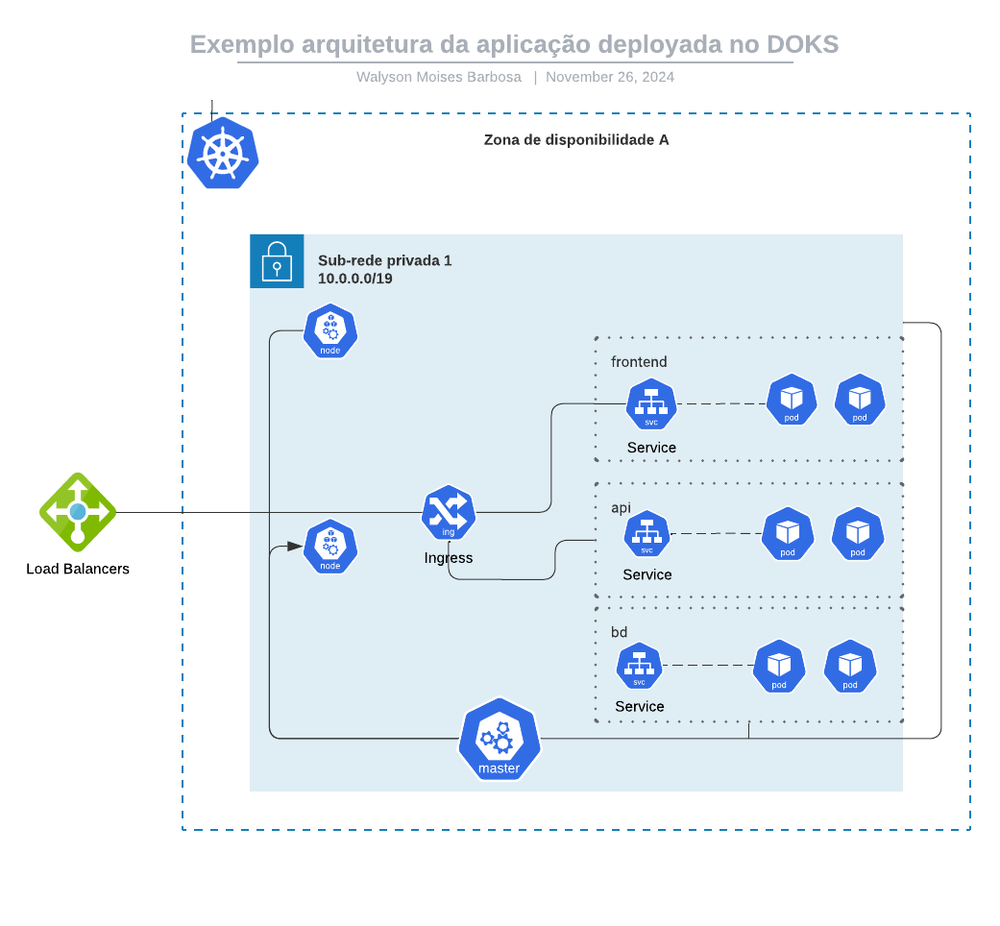
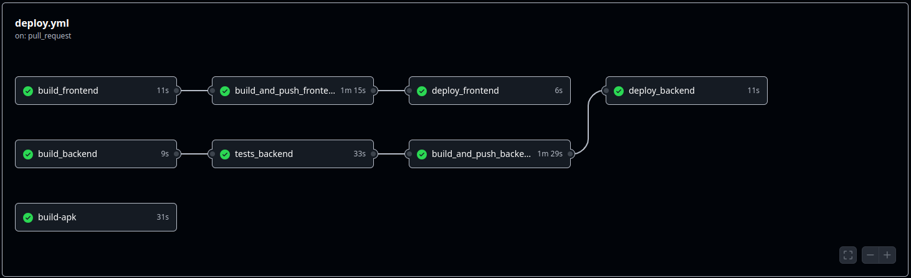
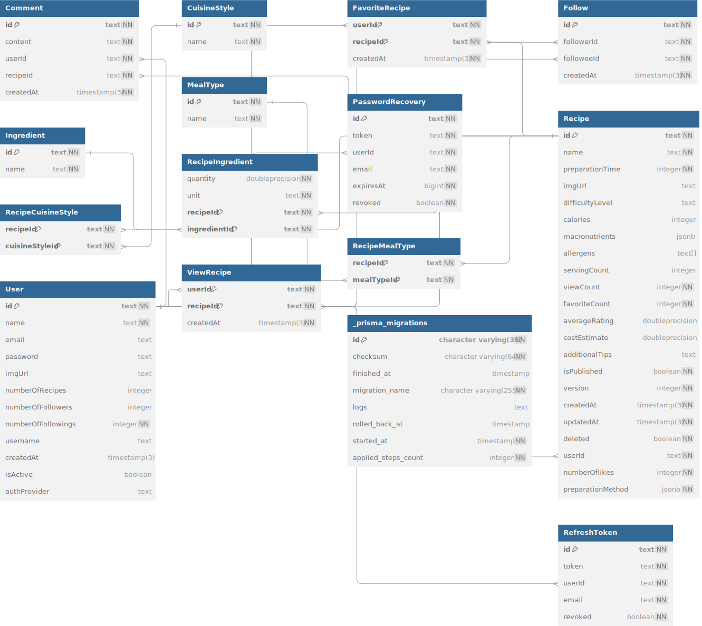

---

## 📚 **Documentação da Aplicação**

---

### API
[](https://god.gw.postman.com/run-collection/27306189-713dd47d-27ac-4b55-b8ee-7eca8519f601?action=collection%2Ffork&source=rip_markdown&collection-url=entityId%3D27306189-713dd47d-27ac-4b55-b8ee-7eca8519f601%26entityType%3Dcollection%26workspaceId%3De4ebd9f6-d6ee-4a8d-9f04-709c9d79265f)  
**swagger doc**: https://api.recipes.waly.dev.br/swagger-ui#/

### **Endpoints Principais**

#### **Autenticação**
- `POST /auth/token`: Geração de token JWT.
- `POST /auth/refresh-token`: Atualização de token JWT.
- `POST /auth/recover-password/token/{email}`: Recuperação de senha.
- `POST /auth/reset-password`: Redefinição de senha.
- `POST /auth//redirect/{authProvider}`: Autenticação com OAuth2 Github ou Google.

#### **Usuários**
- `POST /users`: Cadastro de novo usuário.
- `GET /users`: Listar usuários com paginação e filtro por nome.
- `GET /users/{id}`: Obter informações do usuário.
- `PUT /users/{id}`: Editar informações do usuário.
- `POST /users/follow/{followeeId}`: Seguir outro usuário.
- `DELETE /users/unfollow/{followeeId}`: Deixar de seguir um usuário.
- `GET /users/following/{id}`: Listar seguidores de um usuário.

#### **Receitas**
- `GET /recipes`: Listar receitas com filtros por nome, tipo de refeição, ingredientes, quantidade de proções, faixa de preço, alergênicos, tempo de preparo, ordenação por quantidade de likes ou de visualização e paginação.
- `GET /recipes/{recipeId}`: Obter informações de uma receita.
- `POST /recipes`: Adicionar uma nova receita. 
- `PUT /recipes/{recipeId}`: Editar uma receita existente.
- `DELETE /recipes/{recipeId}`: Marcar receita como deletada (soft-delete).
- `GET /recipes/favourites/{userId}`: Listar receitas favoritas de um usuário.
- `POST /recipes/favourites/{recipeId}`: Adicionar receita aos favoritos.
- `DELETE /recipes/favourites/{recipeId}`: Remover receita dos favoritos.
- `POST /recipes/views/{recipeId}`: Adicionar visualização a uma receita.

#### **Outros**
- `GET /ingredients`: Listar ingredientes.
- `GET /cuisine-styles`: Listar estilos culinários.
- `GET /meal-types`: Listar tipos de refeição.


## 🌟 **Diferenciais Implementados**
- **Autenticação baseada em JWT**: Geração de tokens JWT e refresh token.
- **Autenticação com OAuth2**: Integração com Google e GitHub.
- **Recuperação de Senha**: Envio de e-mail para recuperação de senha.
- **Favoritos**: Adição e remoção de receitas aos favoritos.
- **Seguidores**: Seguir e deixar de seguir outros usuários. (somente backend)
- **Visualizações**: Contagem de visualizações de receitas.
- **Paginação de Resultados**: Listagem de usuários e receitas paginada.
- **Soft-Delete de Receitas**: As receitas deletadas permanecem no banco para recuperação futura.
- **Filtros Avançados**: Pesquisa por nome, tipo de refeição, ingredientes, quantidade de proções, faixa de preço, alergênicos, tempo de preparo, ordenação por quantidade de likes ou de visualização e paginação.
- **Aplicação em React native**: Construida para dispositivos móveis.
- **Testes Unitários**: Cobertura de testes unitários para os principais casos de uso do backend.
- **Testes de Integração**: Testes de integração para os principais endpoints da API.
- **Integração Contínua**: Pipeline de CI/CD com Github Actions.
- **Integração com S3**: Armazenamento de imagens de receitas e usuarios no S3.

---

## ** 📦 Estrutura do Projeto**

### **Backend**
#### **Arquitetura**
A arquitetura segue o padrão **Clean Architecture**, garantindo separação clara de responsabilidades e um núcleo independente de frameworks. A divisão é feita em duas camadas principais: **Core** e **Infra**, onde o **Core** é completamente desacoplado de tecnologias externas.
```
    ├── 📂 src
        ├── 📂 user
            ├── 📂 core
                ├── 📂 entities
                ├── 📂 exceptions
                ├── 📂 interfaces
                ├── 📂 mappers
                ├── 📂 use-cases
            ├── 📂 infra
                ├── 📂 controllers
                ├── 📂 dtos
                ├── 📂 repositories
                ├── 📂 utils
            ├── 📂 recipe
                (semelhante a user)
            ├── 📂 auth
                (semelhante a user)
        
        ├── 📂 utils
            ├── 📂 controller-advice 
        ├── 📄 app.js
```
#### **Detalhes**
- **Core**: Contém toda a lógica de negócio, regras, e contratos que são independentes de qualquer tecnologia ou framework.
- **Infra**: Implementa as interfaces definidas no Core, conectando a aplicação às tecnologias externas, como frameworks, banco de dados, e APIs.
- **Controller Advice**: Middleware responsável por capturar e tratar erros de forma padronizada, garantindo consistência nas respostas da API.

Essa estrutura garante:
- Flexibilidade para troca de tecnologias.
- Facilidade na manutenção e evolução do projeto.
- Reutilização de código e clareza no design.


### **Mobile (React Native)**
A organização do front-end foi planejada para garantir clareza e escalabilidade, com uma estrutura modular e reutilizável. O projeto está dividido em pastas que refletem as responsabilidades de cada parte da aplicação.

```
├── 📂 src
    ├── 📂 app             # Configuração principal da aplicação
    ├── 📂 assets          # Recursos estáticos, como imagens, fontes e ícones
    ├── 📂 components      # Componentes reutilizáveis e específicos
        ├── 📂 home        # Componentes específicos da tela Home
        ├── 📂 login       # Componentes específicos da tela Login
        ├── 📂 recipes     # Componentes específicos da tela de Receitas
        ├── 📂 search      # Componentes específicos da funcionalidade de busca
        ├── 📂 shared      # Componentes compartilhados entre diferentes telas
    ├── 📂 context         # Gerenciamento de estado global e contexto
    ├── 📂 hooks           # Hooks personalizados para reutilização de lógica
    ├── 📂 interfaces      # Tipagens e interfaces TypeScript
    ├── 📂 screens         # Telas principais da aplicação
        ├── 📂 Home        # Tela Home
        ├── 📂 Login       # Tela Login
        ├── 📂 Recipe      # Tela de Detalhes da Receita
        ├── 📂 Search      # Tela de Busca
        ├── 📂 profile
        ├── 📂 Social-Auth
    ├── 📂 services        # Comunicação com APIs e serviços externos
    ├── 📂 styles          # Estilos globais e temas
    ├── 📂 utils           # Funções utilitárias e helpers
    ├── 📄 App.tsx   
```
#### **Detalhes da Estrutura**
- **`app`**: Configurações centrais, como rotas ou inicialização de bibliotecas.
- **`assets`**: Contém recursos como imagens e fontes utilizados na aplicação.
- **`components`**: Organizado em componentes específicos (como `home`, `login`, etc.) e componentes **compartilhados** (dentro da pasta `shared`).
- **`context`**: Gerencia o estado global e implementa providers para Context API.
- **`hooks`**: Lógica reutilizável encapsulada em hooks personalizados.
- **`interfaces`**: Define tipagens para garantir consistência no uso de dados providos da API.
- **`screens`**: Contém as telas principais, que utilizam os componentes.
- **`services`**: Gerencia a comunicação com APIs e encapsula chamadas HTTP.
- **`styles`**: Define estilos globais, temas, e configurações de design.
- **`utils`**: Contém helpers e funções utilitárias para uso geral.

Essa estrutura modular facilita:
- Reutilização de componentes e lógica.
- Escalabilidade do projeto.
- Clareza e organização no desenvolvimento.
### **Design System**
Atualmente, o projeto não utiliza um Design System formalizado. As decisões de design foram tomadas com base em boas práticas de usabilidade e estilo consistente para atender aos requisitos do projeto.

#### **Decisões de Estilo**
- **Paleta de Cores**: Cores foram definidas manualmente, priorizando contraste e acessibilidade para garantir uma boa experiência de usuário.
- **Componentes Reutilizáveis**: Componentes compartilhados (ex.: botões, inputs, modais) foram desenvolvidos para manter consistência visual em diferentes telas.

#### **Possibilidade de Evolução**
Apesar de ainda não possuir um Design System completo, o projeto está preparado para evoluir nesse sentido, permitindo:
- Integração futura de bibliotecas especializadas, como **React Native Paper** ou **Chakra UI for React Native**.
- Definição de um Design System próprio, consolidando a identidade visual e melhorando a experiência do usuário.

Essa abordagem facilita a expansão e manutenção do projeto, permitindo a introdução de novas diretrizes visuais de forma incremental.

### **Infraestrutura**


### **CI/CD**


### **Aplicação**


### **Domain**



## 🛠️ **Como Executar**

### **Pré-requisitos**
- Docker ou Node.js (v16+) e PostgreSQL
- Yarn ou NPM

### **Passos para rodar localmente**
1. Clone o repositório:
 ```bash
 git clone https://github.com/244walyson/recipes.git
 cd recipes-app
```
### com docker 
```
 docker-compose up --build -d
```
aplicação estara disponivel em http://localhost:3000

### sem docker
```bash
    cd backend & npm install
    npm run start
    cd ..
    cd frontend & npm install
    npm run dev
```
não se esqueça de configurar o arquivo .env com as variaveis de ambiente necessarias ex: database_url


### Build apk
```bash
    cd mobile
    npm install
    cd android 
    ./gradlew assembleRelease 
```
o apk estara disponivel em android/app/build/outputs/apk/release/app-release.apk
